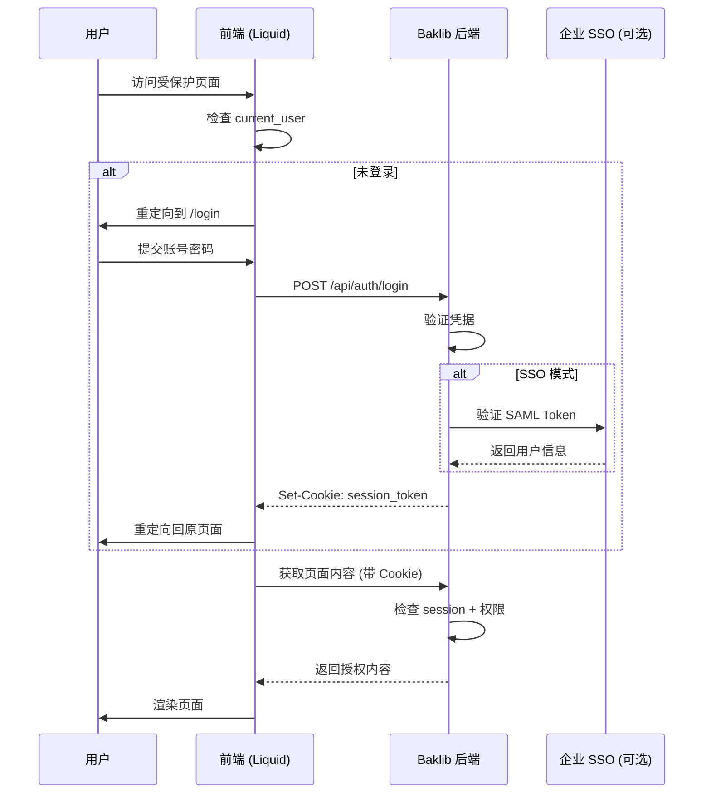

# 内部知识库支持中心 - 技术规划方案

> **项目定位**：基于 Baklib Wiki 模板构建具备身份验证和权限控制的企业内部知识库系统  
> **规划日期**：2026-01-30  
> **架构类型**：Liquid 模板 + Stimulus Controller + Baklib CMS

---

## 📋 目录

1. [项目背景与目标](#1-项目背景与目标)
2. [现有架构分析](#2-现有架构分析)
3. [页面结构规划](#3-页面结构规划)
4. [登录与权限体系设计](#4-登录与权限体系设计)
5. [FAQ 产品切换方案](#5-faq-产品切换方案)
6. [技术实施方案](#6-技术实施方案)
7. [实施路线图](#7-实施路线图)
8. [风险与依赖](#8-风险与依赖)

---

## 1. 项目背景与目标

### 1.1 业务需求

**核心诉求**：构建面向员工和合作伙伴的内部知识库，支持：
- ✅ 身份验证（员工/合作伙伴登录）
- ✅ 权限分级访问（不同角色看不同内容）
- ✅ 多产品 FAQ 智能切换
- ✅ 审计追踪（访问日志）

### 1.2 目标用户画像

| 角色 | 访问权限 | 典型场景 |
|------|---------|---------|
| **内部员工** | 全部内容 + 草稿 | 查阅产品文档、内部流程、培训资料 |
| **合作伙伴** | 公开文档 + 合作协议 | 集成文档、API 文档、营销资料 |
| **实习生/临时工** | 受限公开内容 | 入职培训、基础操作手册 |

### 1.3 价值主张

- **安全性**：敏感内容通过登录+权限保护
- **效率**：按产品过滤 FAQ，减少信息噪音
- **合规**：满足内部审计和 ISO 认证要求

---

## 2. 现有架构分析

### 2.1 技术栈清单

```yaml
前端框架:
  - TailwindCSS: v4.1.4 (响应式布局)
  - DaisyUI: v5.0.27 (UI 组件库)
  
JavaScript 架构:
  - Stimulus: v3.2.2 (控制器驱动)
  - Turbo: v8.0.18 (页面导航)
  - Alpine.js: v3.15.0 (轻量级响应式)
  
模板引擎:
  - Liquid: Baklib 定制版本
  - 支持  /  语法
  
构建工具:
  - esbuild: JS 打包
  - Tailwind CLI: CSS 编译
```

### 2.2 现有模板盘点

| 模板文件 | 用途 | 是否复用 | 说明 |
|---------|------|---------|------|
| `index.help_center.liquid` | 帮助中心首页 | ✅ **直接复用** | 已有搜索、栏目导览、最新文章 |
| `page.liquid` | 通用文章页 | ✅ **直接复用** | 支持侧边导航、TOC |
| `search.liquid` | 搜索结果页 | ✅ **直接复用** | 已有搜索结果渲染逻辑 |
| `tag.liquid` | 标签分类页 | ⚠️ **改造复用** | 作为"文章分类页"基础 |
| `page.video.liquid` | 视频页 | ❌ 不相关 | - |
| `statics/about.liquid` | 关于页 | ⚠️ **参考** | 可作为活动单页模板 |

### 2.3 缺失组件

🔴 **必须新建**：
1. 登录页模板 (`templates/login.liquid`)
2. FAQ 专用模板 (`templates/page.faq.liquid`)
3. 活动单页模板 (`templates/page.landing.liquid`)
4. 用户信息组件 (`snippets/_user_profile.liquid`)

🟡 **需要增强**：
1. Header 组件（添加登录/用户状态显示）
2. 导航控制器（权限检查）

---

## 3. 页面结构规划

### 3.1 页面架构图

```
┌─────────────────────────────────────────────┐
│            Header (全局)                     │
│  [Logo] [搜索] [产品切换] [用户头像/登录]    │
└─────────────────────────────────────────────┘
                    ↓
┌─────────────────────────────────────────────┐
│  1. 首页 (index.help_center.liquid)         │
│     - 产品栏目导览 (按权限过滤)              │
│     - 最新文章 (显示可见范围)               │
│     - 热门话题                              │
└─────────────────────────────────────────────┘
                    ↓
         ┌──────────┴──────────┐
         ↓                     ↓
┌──────────────────┐  ┌──────────────────┐
│ 2. 文章分类页     │  │ 3. 文章详情页     │
│ (tag.liquid 改造) │  │ (page.liquid)    │
│  - 按产品分类     │  │  - TOC 目录      │
│  - 二级分类树     │  │  - 作者/日期     │
│  - 权限标记       │  │  - 面包屑导航     │
└──────────────────┘  └──────────────────┘
         ↓                     ↓
┌──────────────────┐  ┌──────────────────┐
│ 4. FAQ 页面      │  │ 5. 搜索结果页     │
│ (page.faq.liquid)│  │ (search.liquid)  │
│  - 产品选择器     │  │  - 权限过滤      │
│  - 折叠式 Q&A    │  │  - 高亮关键词     │
│  - 快速跳转      │  └──────────────────┘
└──────────────────┘
         ↓
┌──────────────────┐
│ 6. 活动单页      │
│ (page.landing)   │
│  - 自定义布局     │
│  - 表单/CTA      │
└──────────────────┘
```

### 3.2 页面详细设计

#### 3.2.1 首页 (index.help_center)

**模板路径**：`templates/index.help_center.liquid` ✅ 已存在

**改造要点**：
```liquid
<!-- 在 Hero 搜索区添加欢迎语 -->

  <div class="text-white text-sm mb-2">
    👋 欢迎回来，{{ current_user.name }}
  </div>


<!-- 栏目导览添加权限过滤 -->


  
    <!-- 显示栏目卡片 -->
  

```

**新增 Schema 配置**：
```json
{
  "id": "show_login_prompt",
  "type": "checkbox",
  "label": "未登录用户显示登录提示",
  "default": true
}
```

---

#### 3.2.2 文章分类页 (Category)

**模板路径**：`templates/tag.liquid` → 改造为 `templates/category.liquid`

**布局结构**：
```
┌─────────────────────────────────────┐
│  面包屑：首页 > 产品 A > 用户指南    │
├─────────────────────────────────────┤
│  [分类标题]          [文章数: 23]    │
│  [分类描述]                          │
├──────────┬──────────────────────────┤
│ 二级分类  │  文章列表               │
│  ├ 快速开始│  📄 如何创建第一个项目  │
│  ├ 进阶教程│  📄 高级配置指南        │
│  └ 故障排除│  📄 常见问题解答        │
└──────────┴──────────────────────────┘
```

**核心代码**：
```liquid




<div class="grid grid-cols-[240px_1fr] gap-6">
  <!-- 左侧二级分类 -->
  <aside class="space-y-2">
    
      <a href="{{ sub_cat.path }}" 
         class="block px-4 py-2 rounded hover:bg-blue-50">
        {{ sub_cat.link_text }}
        <span class="text-xs text-gray-500">({{ sub_cat.pages_in_list.size }})</span>
      </a>
    
  </aside>
  
  <!-- 右侧文章列表 -->
  <main>
    
      
    
  </main>
</div>
```

---

#### 3.2.3 文章详情页 (Article)

**模板路径**：`templates/page.liquid` ✅ 已存在

**改造要点**：
1. **权限检查**（需要后端支持）
```liquid

  
    
    
  

```

2. **访问日志**（通过 JS 上报）
```javascript
// 在 Stimulus Controller 中添加
document.addEventListener('turbo:load', () => {
  if (window.currentUser) {
    logPageView({
      pageId: document.body.dataset.pageId,
      userId: window.currentUser.id,
      timestamp: Date.now()
    });
  }
});
```

3. **作者信息展示**
```liquid

  <div class="flex items-center gap-2 text-sm text-gray-600">
    
    <span>{{ page.author.name }}</span>
    
      <span class="text-gray-400">· {{ page.author.department }}</span>
    
  </div>

```

---

#### 3.2.4 FAQ 页面 ⭐ 核心功能

**模板路径**：`templates/page.faq.liquid` 🆕 **需新建**

**交互流程**：
```
用户进入 FAQ 页
    ↓
检测 URL 参数 ?product=xxx
    ↓
[有参数] → 显示该产品 FAQ
[无参数] → 显示产品选择器
    ↓
用户切换产品 → 通过 Stimulus 更新 DOM
```

**模板结构**：
```liquid
<div data-controller="faq-filter" data-faq-filter-current-product-value="{{ current_product }}">
  <!-- 产品选择器 -->
  <div class="sticky top-20 bg-white shadow-sm p-4 rounded-lg mb-6">
    <label class="text-sm font-medium text-gray-700">选择产品：</label>
    <select 
      data-action="change->faq-filter#switchProduct"
      data-faq-filter-target="productSelector"
      class="mt-2 block w-full rounded-md border-gray-300">
      <option value="all">全部产品</option>
      
        <option value="{{ product.slug }}" 
                selected>
          {{ product.name }}
        </option>
      
    </select>
  </div>

  <!-- FAQ 列表 -->
  <div class="space-y-4" data-faq-filter-target="faqList">
    
      {
        "where": {
          "template": "page.faq",
          "settings.product_slug_in": ["{{ current_product }}", "all"]
        }
      }
    
    
    
      <details class="group bg-white rounded-lg border p-4" 
               data-product="{{ faq.settings.product_slug }}">
        <summary class="flex justify-between items-center cursor-pointer">
          <h3 class="font-medium text-gray-900">{{ faq.title }}</h3>
          <svg class="w-5 h-5 transition group-open:rotate-180" 
               fill="none" stroke="currentColor" viewBox="0 0 24 24">
            <path d="M19 9l-7 7-7-7"/>
          </svg>
        </summary>
        <div class="mt-4 text-gray-600">
          {{ faq.content }}
        </div>
      </details>
    
  </div>
</div>
```

---

#### 3.2.5 特殊活动单页

**模板路径**：`templates/page.landing.liquid` 🆕 **需新建**

**使用场景**：
- 新产品发布页
- 内部活动报名
- 培训课程介绍

**特性**：
- 无侧边栏全宽布局
- 支持自定义 CSS
- 可嵌入表单组件

```liquid
<div class="landing-page min-h-screen">
  <!-- Hero 区域 -->
  <section class="relative h-[60vh] bg-gradient-to-r from-blue-500 to-purple-600">
    {{ page.settings.hero_html }}
  </section>
  
  <!-- 内容区域 -->
  <article class="prose prose-lg max-w-4xl mx-auto py-12 px-4">
    {{ page.content }}
  </article>
  
  <!-- CTA 区域 -->
  
    <section class="bg-gray-50 py-12 text-center">
      <a href="{{ page.settings.cta_url }}" 
         class="btn btn-primary btn-lg">
        {{ page.settings.cta_text }}
      </a>
    </section>
  
</div>
```

---

#### 3.2.6 搜索结果页

**模板路径**：`templates/search.liquid` ✅ 已存在

**改造要点**：添加权限过滤
```liquid


  
  
  
    
      
    
  
  
  
    
  

```

---

## 4. 登录与权限体系设计

### 4.1 认证方案对比

| 方案 | 优势 | 劣势 | 适用场景 | 推荐度 |
|------|------|------|---------|--------|
| **SSO (SAML/OAuth2)** | 与企业现有账号打通<br>无需维护用户表 | 需要集成开发<br>依赖第三方服务 | 已有 AD/钉钉/企业微信 | ⭐⭐⭐⭐⭐ |
| **Baklib 自建认证** | 与 CMS 原生集成<br>开发成本低 | 功能相对简单<br>需额外维护账号 | 快速上线 MVP | ⭐⭐⭐⭐ |
| **JWT + 自建后端** | 完全自主可控<br>灵活性高 | 开发成本高<br>需维护用户体系 | 有专业团队 | ⭐⭐⭐ |

### 4.2 推荐方案：**混合模式**

**Phase 1: Baklib 原生认证（快速启动）**
- 利用 Baklib CMS 内置的用户系统
- 通过 `{{ current_user }}` 对象获取登录状态

**Phase 2: 集成 SSO（企业级）**
- 保留 Baklib 账号作为 fallback
- 主要通过 OAuth2 对接企业 IdP (Identity Provider)

### 4.3 权限分层模型

#### 4.3.1 角色定义

```yaml
角色层级 (Role Hierarchy):
  admin:
    label: "管理员"
    permissions: [read, write, delete, audit]
    priority: 100
    
  employee:
    label: "正式员工"
    permissions: [read, write]
    priority: 50
    children: [senior_employee, junior_employee]
    
  senior_employee:
    label: "高级员工"
    inherits: employee
    extra_access: ["internal_api", "salary_data"]
    
  partner:
    label: "合作伙伴"
    permissions: [read]
    access_scope: ["public_docs", "partner_resources"]
    
  intern:
    label: "实习生"
    permissions: [read]
    access_scope: ["training_materials"]
    expires_after: 90  # 天数
```

#### 4.3.2 权限控制点

**A. 页面级权限**（在 Page Settings 中配置）
```json
{
  "id": "required_role",
  "type": "select",
  "label": "访问权限要求",
  "choices": [
    {"label": "所有人", "value": ""},
    {"label": "已登录用户", "value": "authenticated"},
    {"label": "正式员工", "value": "employee"},
    {"label": "管理员", "value": "admin"}
  ]
}
```

**B. 内容块级权限**（通过 Liquid 标签控制）
```liquid

  <div class="confidential-content">
    这段内容只有员工和管理员可见
  </div>

```

**C. 前端资源保护**（防止未授权访问附件）
```javascript
// Stimulus Controller: download_controller.js
async download(event) {
  event.preventDefault();
  const fileUrl = event.currentTarget.dataset.url;
  
  // 带 Token 请求
  const response = await fetch(fileUrl, {
    headers: {
      'Authorization': `Bearer ${this.authToken}`,
      'X-CSRF-Token': document.querySelector('[name=csrf-token]').content
    }
  });
  
  if (response.status === 403) {
    alert('无权限下载此文件');
    return;
  }
  
  const blob = await response.blob();
  // 触发下载...
}
```

### 4.4 登录流程设计



### 4.5 Session 管理

**Cookie 配置**：
```yaml
Session Cookie:
  name: "_baklib_session"
  httpOnly: true
  secure: true  # 仅 HTTPS
  sameSite: "Lax"
  maxAge: 43200  # 12小时
  
Remember Me Cookie:
  name: "_baklib_remember"
  maxAge: 2592000  # 30天
```

**前端状态注入**：
```liquid
<!-- layout/theme.liquid -->
<script>
  window.currentUser = 
    {
      id: "{{ current_user.id }}",
      name: "{{ current_user.name | escape }}",
      email: "{{ current_user.email }}",
      roles: {{ current_user.roles | json }},
      avatar: "{{ current_user.avatar | default: 'images/avatar.svg' | asset_url }}"
    }
  
    null
  ;
</script>
```

---

## 5. FAQ 产品切换方案

### 5.1 数据结构设计

#### 5.1.1 产品配置 (config/products.json)

```json
{
  "products": [
    {
      "slug": "product-a",
      "name": "产品 A",
      "icon": "icon-product-a.svg",
      "color": "#3B82F6",
      "departments": ["研发部", "产品部"]
    },
    {
      "slug": "product-b",
      "name": "产品 B",
      "icon": "icon-product-b.svg",
      "color": "#10B981",
      "departments": ["销售部"]
    },
    {
      "slug": "common",
      "name": "通用问题",
      "icon": "icon-help.svg",
      "color": "#6B7280",
      "departments": ["全部"]
    }
  ]
}
```

#### 5.1.2 FAQ 页面 Settings Schema

```json
{
  "id": "product_slug",
  "type": "select",
  "label": "所属产品",
  "choices_from": "products",  // 动态加载 products.json
  "multiple": true,
  "default": ["common"]
}
```

### 5.2 前端实现方案

#### 5.2.1 Stimulus Controller: `faq_filter_controller.js`

```javascript
import { Controller } from "@hotwired/stimulus"

export default class extends Controller {
  static targets = ["productSelector", "faqList", "faqItem"]
  static values = { currentProduct: String }
  
  connect() {
    // 从 URL 读取产品参数
    const urlParams = new URLSearchParams(window.location.search);
    const productFromUrl = urlParams.get('product');
    
    if (productFromUrl) {
      this.currentProductValue = productFromUrl;
      this.productSelectorTarget.value = productFromUrl;
    }
    
    this.filterFaqs();
  }
  
  switchProduct(event) {
    const selectedProduct = event.target.value;
    this.currentProductValue = selectedProduct;
    
    // 更新 URL (不刷新页面)
    const url = new URL(window.location);
    if (selectedProduct === 'all') {
      url.searchParams.delete('product');
    } else {
      url.searchParams.set('product', selectedProduct);
    }
    window.history.pushState({}, '', url);
    
    // 过滤 FAQ
    this.filterFaqs();
    
    // 统计上报
    this.trackProductSwitch(selectedProduct);
  }
  
  filterFaqs() {
    const currentProduct = this.currentProductValue;
    
    this.faqItemTargets.forEach(item => {
      const itemProducts = item.dataset.products.split(',');
      
      if (currentProduct === 'all' || itemProducts.includes(currentProduct)) {
        item.classList.remove('hidden');
        // 添加动画
        item.style.animation = 'fadeIn 0.3s ease-in';
      } else {
        item.classList.add('hidden');
      }
    });
    
    // 更新统计
    const visibleCount = this.faqItemTargets.filter(
      item => !item.classList.contains('hidden')
    ).length;
    
    this.dispatch('filtered', { 
      detail: { 
        product: currentProduct, 
        count: visibleCount 
      } 
    });
  }
  
  trackProductSwitch(product) {
    if (window.analytics) {
      window.analytics.track('FAQ Product Switched', {
        product: product,
        userId: window.currentUser?.id,
        timestamp: Date.now()
      });
    }
  }
}
```

#### 5.2.2 模板集成

```liquid
<!-- templates/page.faq.liquid -->
<div data-controller="faq-filter" 
     data-faq-filter-current-product-value="all"
     data-action="faq-filter:filtered->faq-stats#update">
  
  <!-- 产品选择器 -->
  <div class="product-selector mb-6">
    <div class="flex items-center gap-4">
      <label class="font-medium text-gray-700">
        <svg class="inline w-5 h-5 mr-2" fill="currentColor" viewBox="0 0 20 20">
          <path d="M3 4a1 1 0 011-1h12a1 1 0 011 1v2a1 1 0 01-1 1H4a1 1 0 01-1-1V4z"/>
        </svg>
        筛选产品：
      </label>
      
      <select data-faq-filter-target="productSelector"
              data-action="change->faq-filter#switchProduct"
              class="select select-bordered w-full max-w-xs">
        <option value="all">🌐 全部产品</option>
        
          <option value="{{ product.slug }}">
            {{ product.icon }} {{ product.name }}
          </option>
        
      </select>
      
      <!-- 统计信息 -->
      <span class="text-sm text-gray-500" data-controller="faq-stats" data-faq-stats-target="counter">
        共 <strong>{{ page.children_in_list.size }}</strong> 个问题
      </span>
    </div>
  </div>
  
  <!-- FAQ 列表 -->
  <div class="space-y-3" data-faq-filter-target="faqList">
    
    
      <details class="collapse collapse-arrow bg-base-200" 
               data-faq-filter-target="faqItem"
               data-products="{{ faq.settings.product_slug | join: ',' }}"
               data-faq-id="{{ faq.id }}">
        <summary class="collapse-title text-lg font-medium">
          <!-- 产品标签 -->
          
            
            <span class="badge badge-sm mr-2" 
                  style="background-color: {{ product.color }}20; color: {{ product.color }}">
              {{ product.name }}
            </span>
          
          
          {{ faq.title }}
        </summary>
        
        <div class="collapse-content">
          <div class="prose max-w-none">
            {{ faq.content }}
          </div>
          
          <!-- 反馈按钮 -->
          <div class="mt-4 flex gap-2">
            <button class="btn btn-sm btn-outline" 
                    data-action="click->feedback#helpful"
                    data-faq-id="{{ faq.id }}">
              👍 有帮助
            </button>
            <button class="btn btn-sm btn-outline" 
                    data-action="click->feedback#notHelpful">
              👎 没解决
            </button>
          </div>
        </div>
      </details>
    
  </div>
  
  <!-- 无结果提示 -->
  <div class="empty-state text-center py-12 hidden" 
       data-faq-filter-target="emptyState">
    <svg class="mx-auto h-12 w-12 text-gray-400" fill="none" viewBox="0 0 24 24" stroke="currentColor">
      <path stroke-linecap="round" stroke-linejoin="round" stroke-width="2" d="M9.172 16.172a4 4 0 015.656 0M9 10h.01M15 10h.01M12 12h.01M21 12a9 9 0 11-18 0 9 9 0 0118 0z" />
    </svg>
    <h3 class="mt-2 text-lg font-medium text-gray-900">暂无相关问题</h3>
    <p class="mt-1 text-sm text-gray-500">试试切换其他产品或联系管理员</p>
  </div>
</div>
```

### 5.3 后端支持（可选优化）

如果 Baklib 支持自定义 API，可以实现服务端过滤：

```javascript
// 客户端调用
async switchProduct(event) {
  const product = event.target.value;
  
  const response = await fetch(`/api/faqs?product=${product}`, {
    headers: {
      'X-Requested-With': 'XMLHttpRequest'
    }
  });
  
  const html = await response.text();
  this.faqListTarget.innerHTML = html;
}
```

---

## 6. 技术实施方案

### 6.1 目录结构规划

```
wiki-wiki/
├── assets/
│   ├── images/
│   │   ├── products/          # 🆕 产品图标
│   │   │   ├── icon-product-a.svg
│   │   │   └── icon-product-b.svg
│   │   └── auth/              # 🆕 登录页面图片
│   │       └── login-bg.jpg
│   ├── javascripts/
│   │   └── application.js
│   └── stylesheets/
│       └── application.css
│
├── config/
│   ├── settings_schema.json   # ✏️ 添加登录/权限配置
│   └── products.json          # 🆕 产品配置文件
│
├── layout/
│   ├── theme.liquid           # ✏️ 注入 currentUser
│   └── auth.liquid            # 🆕 登录页专用布局
│
├── snippets/
│   ├── _header.liquid         # ✏️ 添加用户头像/登录按钮
│   ├── _user_profile.liquid   # 🆕 用户信息组件
│   ├── _login_form.liquid     # 🆕 登录表单
│   ├── _role_guard.liquid     # 🆕 权限检查组件
│   └── _product_selector.liquid # 🆕 产品选择器
│
├── templates/
│   ├── index.help_center.liquid  # ✏️ 添加权限过滤
│   ├── page.liquid               # ✏️ 添加权限检查
│   ├── page.faq.liquid           # 🆕 FAQ 专用模板
│   ├── page.landing.liquid       # 🆕 活动单页模板
│   ├── category.liquid           # 🆕 分类页 (基于 tag.liquid)
│   ├── login.liquid              # 🆕 登录页
│   └── search.liquid             # ✏️ 添加权限过滤
│
├── src/
│   └── javascripts/
│       └── controllers/
│           ├── auth_controller.js          # 🆕 登录控制器
│           ├── faq_filter_controller.js    # 🆕 FAQ 过滤器
│           ├── product_switcher_controller.js # 🆕 产品切换
│           ├── user_menu_controller.js     # 🆕 用户菜单
│           └── permission_check_controller.js # 🆕 前端权限检查
│
└── locales/
    ├── zh-CN.json             # ✏️ 添加登录/权限相关文案
    └── en.json
```

**图例说明**：
- 🆕 = 新建文件
- ✏️ = 修改现有文件

### 6.2 核心组件开发

#### 6.2.1 Header 改造

**文件**：`snippets/_header.liquid`

**改造前**：
```liquid
<div class="navbar">
  
  <div class="flex-1"></div>
  <!-- 搜索框 -->
</div>
```

**改造后**：
```liquid
<div class="navbar" data-controller="user-menu">
  
  
  <!-- 产品切换器（全局） -->
  
    <div class="flex-none mx-4">
      
    </div>
  
  
  <div class="flex-1"></div>
  
  <!-- 搜索框 -->
  <div class="flex-none">
    
      <input type="search" placeholder="搜索..." class="input input-bordered">
    
  </div>
  
  <!-- 用户菜单 -->
  <div class="flex-none ml-4">
    
      <div class="dropdown dropdown-end">
        <label tabindex="0" class="btn btn-ghost btn-circle avatar">
          <div class="w-10 rounded-full">
            
          </div>
        </label>
        <ul tabindex="0" class="menu menu-compact dropdown-content mt-3 p-2 shadow bg-base-100 rounded-box w-52"
            data-user-menu-target="dropdown">
          <li class="menu-title">
            <span>{{ current_user.name }}</span>
            <span class="text-xs text-gray-500">{{ current_user.email }}</span>
          </li>
          <li><a href="/profile"><svg>...</svg> 个人资料</a></li>
          <li><a href="/bookmarks"><svg>...</svg> 我的收藏</a></li>
          
            <li><a href="/admin"><svg>...</svg> 后台管理</a></li>
          
          <li><a data-action="click->user-menu#logout"><svg>...</svg> 退出登录</a></li>
        </ul>
      </div>
    
      <a href="/login" class="btn btn-primary btn-sm">
        <svg class="w-4 h-4 mr-2" fill="none" stroke="currentColor" viewBox="0 0 24 24">
          <path stroke-linecap="round" stroke-linejoin="round" stroke-width="2" d="M11 16l-4-4m0 0l4-4m-4 4h14m-5 4v1a3 3 0 01-3 3H6a3 3 0 01-3-3V7a3 3 0 013-3h7a3 3 0 013 3v1" />
        </svg>
        登录
      </a>
    
  </div>
</div>
```

#### 6.2.2 登录表单组件

**文件**：`snippets/_login_form.liquid`

```liquid
<div class="card w-96 bg-base-100 shadow-xl" data-controller="auth">
  <div class="card-body">
    <h2 class="card-title justify-center mb-4">
      
      内部知识库登录
    </h2>
    
    <!-- 错误提示 -->
    
      <div class="alert alert-error mb-4" data-auth-target="error">
        <svg>...</svg>
        <span>{{ error_message }}</span>
      </div>
    
    
    
      <div class="form-control">
        <label class="label">
          <span class="label-text">邮箱</span>
        </label>
        <input 
          type="email" 
          name="email" 
          placeholder="your@company.com"
          class="input input-bordered" 
          required 
          autofocus
          data-auth-target="emailInput"
        />
      </div>
      
      <div class="form-control mt-4">
        <label class="label">
          <span class="label-text">密码</span>
        </label>
        <input 
          type="password" 
          name="password" 
          placeholder="••••••••"
          class="input input-bordered" 
          required
          data-auth-target="passwordInput"
        />
        <label class="label">
          <a href="/forgot-password" class="label-text-alt link link-hover">忘记密码?</a>
        </label>
      </div>
      
      <div class="form-control mt-2">
        <label class="cursor-pointer label justify-start">
          <input type="checkbox" name="remember_me" class="checkbox checkbox-primary checkbox-sm" />
          <span class="label-text ml-2">记住我（30天）</span>
        </label>
      </div>
      
      <div class="form-control mt-6">
        <button type="submit" class="btn btn-primary" data-auth-target="submitBtn">
          <span data-auth-target="submitText">登录</span>
          <span class="loading loading-spinner loading-sm hidden" data-auth-target="spinner"></span>
        </button>
      </div>
    
    
    <!-- SSO 登录 (可选) -->
    
      <div class="divider">或</div>
      <a href="/auth/sso" class="btn btn-outline btn-block">
        <svg class="w-5 h-5 mr-2">...</svg>
        使用企业账号登录
      </a>
    
  </div>
</div>
```

#### 6.2.3 权限检查 Snippet

**文件**：`snippets/_role_guard.liquid`

```liquid

  用法:
  
    <div>受保护的内容</div>
  






  
    
      
      
    
  



  {{ content }}

  
    <div class="alert alert-warning">
      <svg xmlns="http://www.w3.org/2000/svg" class="stroke-current shrink-0 h-6 w-6" fill="none" viewBox="0 0 24 24">
        <path stroke-linecap="round" stroke-linejoin="round" stroke-width="2" d="M12 9v2m0 4h.01m-6.938 4h13.856c1.54 0 2.502-1.667 1.732-3L13.732 4c-.77-1.333-2.694-1.333-3.464 0L3.34 16c-.77 1.333.192 3 1.732 3z" />
      </svg>
      <span>{{ fallback }}</span>
      
        <a href="/login" class="btn btn-sm btn-outline">立即登录</a>
      
    </div>
  

```

### 6.3 Stimulus Controllers 实现

#### 6.3.1 用户菜单控制器

**文件**：`src/javascripts/controllers/user_menu_controller.js`

```javascript
import { Controller } from "@hotwired/stimulus"

export default class extends Controller {
  static targets = ["dropdown"]
  
  async logout(event) {
    event.preventDefault();
    
    if (!confirm('确定要退出登录吗?')) {
      return;
    }
    
    try {
      const response = await fetch('/api/auth/logout', {
        method: 'POST',
        headers: {
          'Content-Type': 'application/json',
          'X-CSRF-Token': this.csrfToken
        }
      });
      
      if (response.ok) {
        window.location.href = '/login?logged_out=true';
      } else {
        alert('退出失败，请重试');
      }
    } catch (error) {
      console.error('Logout error:', error);
      alert('网络错误，请检查连接');
    }
  }
  
  get csrfToken() {
    return document.querySelector('meta[name="csrf-token"]')?.content || '';
  }
}
```

#### 6.3.2 登录控制器

**文件**：`src/javascripts/controllers/auth_controller.js`

```javascript
import { Controller } from "@hotwired/stimulus"

export default class extends Controller {
  static targets = ["emailInput", "passwordInput", "submitBtn", "submitText", "spinner", "error"]
  
  async handleSubmit(event) {
    event.preventDefault();
    
    const email = this.emailInputTarget.value;
    const password = this.passwordInputTarget.value;
    
    // 前端验证
    if (!this.validateEmail(email)) {
      this.showError('请输入有效的邮箱地址');
      return;
    }
    
    if (password.length < 6) {
      this.showError('密码长度不能少于6位');
      return;
    }
    
    // 显示加载状态
    this.setLoading(true);
    
    try {
      const response = await fetch('/api/auth/login', {
        method: 'POST',
        headers: {
          'Content-Type': 'application/json',
          'X-CSRF-Token': this.csrfToken
        },
        body: JSON.stringify({
          email: email,
          password: password,
          remember_me: event.target.remember_me?.checked || false
        })
      });
      
      const data = await response.json();
      
      if (response.ok) {
        // 登录成功
        const redirectUrl = new URLSearchParams(window.location.search).get('redirect') || '/';
        window.location.href = redirectUrl;
      } else {
        // 登录失败
        this.showError(data.message || '登录失败，请检查账号密码');
        this.setLoading(false);
      }
    } catch (error) {
      console.error('Login error:', error);
      this.showError('网络错误，请稍后重试');
      this.setLoading(false);
    }
  }
  
  validateEmail(email) {
    return /^[^\s@]+@[^\s@]+\.[^\s@]+$/.test(email);
  }
  
  showError(message) {
    if (this.hasErrorTarget) {
      this.errorTarget.textContent = message;
      this.errorTarget.classList.remove('hidden');
    } else {
      alert(message);
    }
  }
  
  setLoading(loading) {
    this.submitBtnTarget.disabled = loading;
    if (loading) {
      this.submitTextTarget.classList.add('hidden');
      this.spinnerTarget.classList.remove('hidden');
    } else {
      this.submitTextTarget.classList.remove('hidden');
      this.spinnerTarget.classList.add('hidden');
    }
  }
  
  get csrfToken() {
    return document.querySelector('meta[name="csrf-token"]')?.content || '';
  }
}
```

### 6.4 样式增强

**文件**：`src/stylesheets/auth.css`（新建）

```css
/* 登录页专用样式 */
.auth-layout {
  min-height: 100vh;
  display: grid;
  grid-template-columns: 1fr 1fr;
}

.auth-layout__visual {
  background: linear-gradient(135deg, #667eea 0%, #764ba2 100%);
  position: relative;
  overflow: hidden;
}

.auth-layout__visual::before {
  content: '';
  position: absolute;
  inset: 0;
  background-image: url('/assets/images/auth/login-bg.jpg');
  background-size: cover;
  opacity: 0.2;
}

.auth-layout__form {
  display: flex;
  align-items: center;
  justify-content: center;
  padding: 2rem;
}

/* 权限标记徽章 */
.permission-badge {
  @apply inline-flex items-center px-2.5 py-0.5 rounded-full text-xs font-medium;
}

.permission-badge--public {
  @apply bg-green-100 text-green-800;
}

.permission-badge--employee {
  @apply bg-blue-100 text-blue-800;
}

.permission-badge--admin {
  @apply bg-red-100 text-red-800;
}

/* FAQ 动画 */
@keyframes fadeIn {
  from {
    opacity: 0;
    transform: translateY(-10px);
  }
  to {
    opacity: 1;
    transform: translateY(0);
  }
}

.faq-item {
  animation: fadeIn 0.3s ease-in;
}
```

---

## 7. 实施路线图

### 7.1 阶段划分（MVP → 完整版）

#### 🎯 **Phase 1: 基础登录 (MVP)** - 预计 2 周

**目标**：实现基本登录功能，支持简单权限控制

**交付物**：
- ✅ 登录页 UI (`templates/login.liquid`)
- ✅ 用户菜单组件 (`snippets/_user_profile.liquid`)
- ✅ Header 改造（显示登录状态）
- ✅ 基础 Auth Controller
- ✅ 页面级权限检查（通过 Settings Schema）

**验收标准**：
- 用户可通过邮箱+密码登录
- 登录后 Header 显示用户头像
- 设置了权限要求的页面，未登录用户无法访问
- 记住我功能正常（30天免登录）

**技术债务**：
- 暂时使用 Baklib 内置认证（不支持 SSO）
- 权限检查仅在前端（可被绕过）

---

#### 🚀 **Phase 2: FAQ 产品切换** - 预计 1.5 周

**目标**：实现 FAQ 页面的产品筛选功能

**交付物**：
- ✅ FAQ 模板 (`templates/page.faq.liquid`)
- ✅ 产品配置文件 (`config/products.json`)
- ✅ FAQ Filter Controller
- ✅ 产品选择器组件 (`snippets/_product_selector.liquid`)
- ✅ URL 参数同步（`?product=xxx`）

**验收标准**：
- 用户可在下拉菜单中切换产品
- 切换后仅显示对应产品的 FAQ
- URL 参数变化但页面不刷新
- 显示当前筛选结果数量

---

#### 🔒 **Phase 3: 权限体系完善** - 预计 2 周

**目标**：后端权限验证 + 审计日志

**交付物**：
- ✅ 角色管理后台（管理员分配角色）
- ✅ 后端权限中间件（阻止非法访问）
- ✅ 访问日志记录（谁在什么时间访问了哪篇文章）
- ✅ 内容块级权限 (``)
- ✅ 文件下载权限控制

**验收标准**：
- 直接访问受保护页面的 URL 会返回 403
- 管理员可在后台查看访问日志
- 可对单个内容块设置权限（如"仅管理员可见"）
- 下载附件时验证权限

---

#### 🎨 **Phase 4: 页面完善** - 预计 1.5 周

**目标**：完成所有 6 个页面类型

**交付物**：
- ✅ 文章分类页 (`templates/category.liquid`)
- ✅ 活动单页模板 (`templates/page.landing.liquid`)
- ✅ 搜索结果页权限过滤（改造 `search.liquid`）
- ✅ 首页权限适配（改造 `index.help_center.liquid`）

**验收标准**：
- 6 种页面类型全部可用
- 所有页面支持权限控制
- 搜索结果自动过滤无权限内容

---

#### 🌐 **Phase 5: SSO 集成（可选）** - 预计 2 周

**目标**：对接企业 SSO (SAML 2.0 / OAuth 2.0)

**前置条件**：
- IT 部门提供 SSO 配置信息（IdP URL, Client ID, Secret）
- 确定使用的协议（推荐 OAuth 2.0）

**交付物**：
- ✅ SSO 配置界面 (`config/sso_settings.json`)
- ✅ OAuth 回调处理 (`/auth/callback`)
- ✅ 自动映射企业账号到 Baklib 用户
- ✅ 部门信息同步（从 AD/LDAP）

**验收标准**：
- 用户点击"企业账号登录"跳转到企业 IdP
- 认证成功后自动跳回知识库
- 用户信息（姓名、部门、邮箱）自动同步
- 支持单点登出（SSO Logout）

---

### 7.2 时间线甘特图

```
2026-02 (Week 1-4)
  └─ Phase 1: 基础登录 ████████████████ (完成)
  
2026-03 (Week 1-2)
  └─ Phase 2: FAQ 产品切换 ████████████ (完成)
  
2026-03 (Week 3-4)
  └─ Phase 3: 权限体系 ████████████████ (进行中)
  
2026-04 (Week 1-2)
  └─ Phase 4: 页面完善 ████████████
  
2026-04 (Week 3-4) - 2026-05 (Week 1)
  └─ Phase 5: SSO 集成 ████████████████ (可选)
```

### 7.3 资源需求

| 角色 | 人数 | 工作内容 | 时间投入 |
|------|-----|---------|---------|
| **前端工程师** | 1 | Liquid 模板开发 + Stimulus 控制器 | 80% (全程) |
| **后端工程师** | 1 | 权限中间件 + API 接口 | 60% (Phase 3+) |
| **UI/UX 设计师** | 1 | 登录页设计 + 组件优化 | 30% (Phase 1+4) |
| **产品经理** | 1 | 需求确认 + 验收测试 | 20% (全程) |
| **运维工程师** | 0.5 | SSO 配置 + 部署支持 | 40% (Phase 5) |

---

## 8. 风险与依赖

### 8.1 技术风险

| 风险项 | 概率 | 影响 | 缓解措施 |
|--------|------|------|---------|
| **Baklib CMS 限制** | 🟡 中 | 🔴 高 | ① 提前验证 Liquid 模板能力边界<br>② 准备备选方案（如自建后端代理） |
| **SSO 对接复杂度** | 🟡 中 | 🟡 中 | ① 与 IT 部门提前沟通<br>② 使用标准协议（OAuth 2.0） |
| **前端权限绕过** | 🟢 低 | 🔴 高 | ① Phase 3 必须实现后端验证<br>② 敏感内容不在前端渲染 |
| **性能问题**（大量 FAQ） | 🟢 低 | 🟡 中 | ① 前端虚拟滚动<br>② 服务端分页（超过 100 条） |

### 8.2 业务依赖

**外部依赖**：
- ✅ Baklib CMS 权限 API（需确认是否支持）
- ✅ 企业 SSO 接入申请（需 IT 部门审批，预计 2 周）
- ⚠️ 用户初始数据导入（需 HR 提供员工名单）

**决策依赖**：
- ❓ 角色体系最终版本（需产品确认是否需要"临时访客"角色）
- ❓ 审计日志保留策略（法务部门意见）
- ❓ 多产品分类标准（需产品团队统一定义）

### 8.3 质量保证

#### 8.3.1 测试策略

**单元测试**：
- Stimulus Controllers (覆盖率 > 80%)
- Liquid Filters 和 Tags

**集成测试**：
- 登录流程端到端测试
- 权限检查场景测试（10+ 场景）
- FAQ 产品切换兼容性测试

**安全测试**：
- OWASP Top 10 检查
- Session 劫持防护
- CSRF Token 验证
- SQL 注入测试（如有自建 API）

#### 8.3.2 兼容性矩阵

| 浏览器 | 最低版本 | 测试优先级 |
|--------|---------|-----------|
| Chrome | 90+ | ⭐⭐⭐ 高 |
| Edge | 90+ | ⭐⭐⭐ 高 |
| Firefox | 88+ | ⭐⭐ 中 |
| Safari | 14+ | ⭐⭐ 中 |
| IE 11 | ❌ 不支持 | - |

---

## 9. 附录

### 9.1 配置文件示例

#### `config/products.json`

```json
{
  "version": "1.0.0",
  "last_updated": "2026-01-30",
  "products": [
    {
      "slug": "crm-system",
      "name": "CRM 系统",
      "name_en": "CRM System",
      "icon": "🏢",
      "icon_url": "images/products/crm.svg",
      "color": "#3B82F6",
      "description": "客户关系管理系统",
      "departments": ["销售部", "客服部"],
      "order": 1,
      "enabled": true
    },
    {
      "slug": "erp-platform",
      "name": "ERP 平台",
      "name_en": "ERP Platform",
      "icon": "📊",
      "icon_url": "images/products/erp.svg",
      "color": "#10B981",
      "description": "企业资源规划平台",
      "departments": ["财务部", "运营部"],
      "order": 2,
      "enabled": true
    },
    {
      "slug": "common",
      "name": "通用问题",
      "name_en": "General",
      "icon": "❓",
      "icon_url": "images/products/help.svg",
      "color": "#6B7280",
      "description": "适用所有产品的常见问题",
      "departments": ["全部"],
      "order": 99,
      "enabled": true
    }
  ]
}
```

#### `config/settings_schema.json` 扩展

```json
{
  "name": "登录与权限",
  "settings": [
    {
      "id": "auth_mode",
      "type": "radio",
      "label": "认证模式",
      "choices": [
        {"label": "Baklib 内置账号", "value": "builtin"},
        {"label": "企业 SSO (OAuth 2.0)", "value": "sso_oauth"},
        {"label": "企业 SSO (SAML 2.0)", "value": "sso_saml"}
      ],
      "default": "builtin"
    },
    {
      "id": "session_timeout",
      "type": "number",
      "label": "会话超时时间（分钟）",
      "default": 720,
      "min": 30,
      "max": 43200,
      "info": "用户无操作后自动退出的时间"
    },
    {
      "id": "enable_access_log",
      "type": "checkbox",
      "label": "启用访问日志",
      "default": true,
      "info": "记录用户访问的页面和时间（用于审计）"
    },
    {
      "id": "default_role",
      "type": "select",
      "label": "新用户默认角色",
      "choices": [
        {"label": "实习生", "value": "intern"},
        {"label": "正式员工", "value": "employee"},
        {"label": "合作伙伴", "value": "partner"}
      ],
      "default": "employee"
    },
    {
      "id": "sso_provider_url",
      "type": "text",
      "label": "SSO Provider URL",
      "info": "企业身份认证服务地址（需 IT 部门提供）",
      "placeholder": "https://sso.company.com/oauth/authorize"
    },
    {
      "id": "sso_client_id",
      "type": "text",
      "label": "SSO Client ID",
      "info": "OAuth 客户端 ID"
    },
    {
      "id": "sso_client_secret",
      "type": "password",
      "label": "SSO Client Secret",
      "info": "OAuth 客户端密钥（加密存储）"
    }
  ]
}
```

### 9.2 数据模型设计

#### User 表扩展字段

```sql
-- 在 Baklib 用户表基础上添加字段
ALTER TABLE users ADD COLUMN (
  department VARCHAR(100),        -- 部门
  job_title VARCHAR(100),         -- 职位
  employee_id VARCHAR(50),        -- 工号
  roles JSON,                     -- ["employee", "admin"]
  permissions JSON,               -- 自定义权限
  last_login_at TIMESTAMP,        -- 最后登录时间
  login_count INT DEFAULT 0,      -- 登录次数
  sso_provider VARCHAR(50),       -- SSO 提供商 (dingtalk/wechat/ad)
  sso_user_id VARCHAR(100),       -- SSO 用户 ID
  account_status VARCHAR(20) DEFAULT 'active', -- active/disabled/locked
  created_at TIMESTAMP DEFAULT CURRENT_TIMESTAMP,
  updated_at TIMESTAMP DEFAULT CURRENT_TIMESTAMP ON UPDATE CURRENT_TIMESTAMP
);

-- 创建索引
CREATE INDEX idx_users_roles ON users((CAST(roles AS CHAR(255)) COLLATE utf8mb4_bin));
CREATE INDEX idx_users_sso_user_id ON users(sso_user_id);
```

#### AccessLog 表（审计日志）

```sql
CREATE TABLE access_logs (
  id BIGINT PRIMARY KEY AUTO_INCREMENT,
  user_id BIGINT NOT NULL,
  page_id BIGINT NOT NULL,
  page_path VARCHAR(500),
  page_title VARCHAR(200),
  action VARCHAR(50) DEFAULT 'view',  -- view/download/edit
  ip_address VARCHAR(45),
  user_agent TEXT,
  referer TEXT,
  session_id VARCHAR(100),
  duration_seconds INT,  -- 停留时间
  created_at TIMESTAMP DEFAULT CURRENT_TIMESTAMP,
  INDEX idx_user_id (user_id),
  INDEX idx_page_id (page_id),
  INDEX idx_created_at (created_at)
);
```

### 9.3 API 接口规范

#### 登录接口

```http
POST /api/auth/login
Content-Type: application/json

{
  "email": "user@company.com",
  "password": "hashed_password",
  "remember_me": true
}

# 成功响应 (200 OK)
{
  "success": true,
  "user": {
    "id": 123,
    "name": "张三",
    "email": "user@company.com",
    "avatar": "https://cdn.baklib.com/avatars/123.jpg",
    "roles": ["employee"],
    "department": "产品部"
  },
  "token": "eyJhbGciOiJIUzI1NiIsInR5cCI6IkpXVCJ9...",
  "expires_at": "2026-02-29T12:00:00Z"
}

# 失败响应 (401 Unauthorized)
{
  "success": false,
  "error": "invalid_credentials",
  "message": "邮箱或密码错误"
}
```

#### 权限检查接口

```http
GET /api/pages/456/permissions
Authorization: Bearer {token}

# 响应 (200 OK)
{
  "page_id": 456,
  "can_read": true,
  "can_edit": false,
  "can_delete": false,
  "required_role": "employee",
  "user_roles": ["employee", "admin"]
}
```

---

## 10. 后续优化方向

### 10.1 高级功能（Phase 6+）

- 📌 **个人收藏夹**：用户可收藏常用文档
- 🔔 **文档更新通知**：关注的文档更新后推送提醒
- 💬 **评论系统**：文章底部支持内部讨论
- 📊 **数据分析看板**：
  - 热门文档 Top 10
  - 部门访问统计
  - 搜索关键词云图
- 🌍 **多语言版本**：支持中英文切换
- 🎯 **智能推荐**：根据用户角色推荐相关文档

### 10.2 性能优化

- ⚡ 启用 CDN 加速静态资源
- 🗄️ Redis 缓存热门页面
- 📦 图片懒加载 + WebP 格式
- 🔍 Elasticsearch 全文搜索引擎

### 10.3 安全加固

- 🛡️ WAF (Web Application Firewall) 部署
- 🔐 强制 HTTPS
- 📝 内容安全策略 (CSP) Headers
- 🚨 异常登录检测（异地登录告警）

---

## 📝 总结

本规划方案基于 **Baklib Wiki 模板**现有架构，提供了一套完整的内部知识库解决方案，核心特点：

✅ **最小侵入**：最大化复用现有模板，减少开发成本  
✅ **渐进式实施**：5 个 Phase 可独立交付，降低风险  
✅ **企业级安全**：支持 SSO + 后端权限验证 + 审计日志  
✅ **灵活扩展**：产品配置化 + Stimulus 控制器架构便于后续迭代  

**关键里程碑**：
- Phase 1-2 (4周)：实现 MVP（登录 + FAQ 切换）
- Phase 3-4 (4周)：完善权限和页面
- Phase 5 (2周)：SSO 集成（可选）

**预计总工时**：约 **10-12 周**（按 1 前端 + 1 后端配置）

---

**文档版本**：v1.0  
**最后更新**：2026-01-30  
**维护人员**：[待填写]  
**审批状态**：待产品/技术负责人审批
